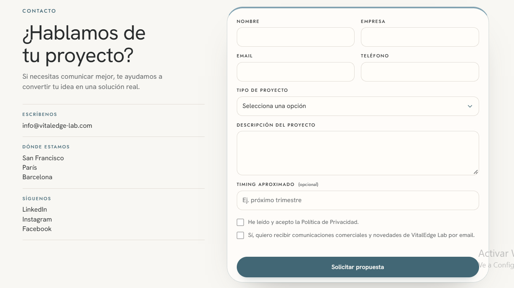

# Serralleria Carbó · Refinament global i redisseny de Contacte

**Destinatari:** Claude Code, dins del repositori de Serralleria Carbó  
**Data:** 06/10/2026  
**Origen:** indicacions del director al PDF «Documento sin título.pdf», de dues pàgines  
**Lliurament:** implementar els canvis concrets d'aquest brief, presentar les propostes editorials addicionals i verificar el resultat

## 1. Objectiu i abast

Fer que la web sigui més clara, lluminosa, compacta i agradable de navegar. Reduir la mida excessiva dels titulars, l'espai buit i els textos redundants, mantenint una presència visual professional i diferenciant Particulars d'Industrial.

El canvi més important és Contacte: ha de passar de la suma de capçalera, explicacions, selectors grans, formulari i columna redundant a una composició senzilla que permeti contactar immediatament.

Aquest document és un encàrrec d'implementació. Les mides, tonalitats i composicions proposades són la direcció de treball; comprova-les renderitzades i ajusta-les dins d'aquesta direcció. No donis per acabada una tasca només perquè el codi compili.

### Autoritat de les decisions

1. Aquest brief recull les indicacions més recents del director i preval sobre les decisions anteriors incompatibles.
2. Es manté la marca, Source Sans 3 local, l'accent bordeus `#7c2a30`, la branca Industrial amb identitat metàl·lica i la separació dels dos camins per tipus d'encàrrec.
3. **La presentació comercial deixa d'estar limitada a «sèries curtes».** La instrucció antiga de `CLAUDE.md` de conservar aquest eslògan queda superada.
4. **Home i Particulars passen a grisos clars combinats amb blanc trencat.** La direcció anterior de superfícies negres o exclusivament blanques queda superada en aquests àmbits.
5. Les dades confirmades, els textos legals aprovats i els casos reals mantenen el seu valor documental. No inventis abast geogràfic, capacitat productiva, certificacions, terminis o prestacions.
6. No ampliïs el sitemap ni reactivis les pàgines interiors d'Industrial ajornades. No recuperis `/empresa/`, retirada en la revisió més recent.

### Dues vies de treball, per respectar el PDF

- **Canvis concrets autoritzats:** executa les modificacions de disseny i les correccions editorials expressament definides aquí.
- **Reescriptures addicionals:** el PDF demana una proposta per a cada text abans de modificar-lo. Audita tota la web, conserva els textos útils i presenta les propostes no definides en aquest brief per validar-les. No reescriguis tota la web per iniciativa pròpia ni aturis els canvis visuals independents mentre aquestes propostes estan pendents.

## 2. Fonts que has de consultar

Treballa des de l'estat real del repositori, inclosos els canvis locals del director. Inspecciona `git status` abans de començar i conserva qualsevol feina prèvia.

- `CLAUDE.md`: contracte de desenvolupament, amb les excepcions explícites d'aquest brief.
- `fases/README.md`: estat de fases actual.
- `fases/fase-7/FASE7-brief-millores-ux-i-continguts.md`, `FASE7-menys-text.md` i `FASE7-home-i-grisos-industrial.md`: revisions recents que cal preservar quan no es contradiuen amb aquest document.
- `content/ca/`, `src/i18n/ui.ts` i les plantilles: contingut editorial i text real renderitzat.
- `src/styles/roles.css` i els fulls de cada plantilla: mida, ritme i superfícies actuals.
- `src/config/site.ts`: telèfons, correu, horari i adreça confirmats.
- `content/ca/legal-formulari.md` i els documents de Fase 8: informació i consentiments aprovats.
- `fases/fase-7/referencies/contacte-referencia-client-2026-10-06.png`: referència visual de Contacte, extreta directament del PDF.

PDF original al dispositiu del director: `C:/Users/CarlesPC/Downloads/Documento sin título.pdf`. El present brief i el PNG permeten executar l'encàrrec sense dependre d'aquesta ruta externa.

Impeccable s'utilitza exclusivament com a criteri manual de revisió. No executis ordres que modifiquin fitxers, redefineixin el disseny o instal·lin hooks. Les skills de detall visual i moviment són complementàries i no poden substituir aquest brief.

## 3. Inventari complet dels canvis demanats

| ID | Àmbit | Modificació | Resultat que s'ha de comprovar |
| --- | --- | --- | --- |
| G01 | Tota la web | Revisió de tots els textos i proposta individual per als que no aporten valor | Informe editorial amb text actual, ubicació, proposta i motiu; els textos útils es conserven |
| G02 | Tota la web | Reduir tots els titulars | Jerarquia coherent en totes les plantilles i cap titular desproporcionat |
| G03 | Tota la web | Reduir espais buits i càrrega visual | Seccions més curtes, sense apinyar text ni reduir la llegibilitat |
| G04 | Peu compartit | Aproximadament la meitat d'espai | Menys padding i altura sobrera, conservant logo, enllaços i accessibilitat |
| H01 | Home | Substituir les superfícies negres/gris fosc per gris clar | Cap bloc de fons sòlid gairebé negre dominant el recorregut |
| H02 | Home i Particulars | Bordeus exactament igual al logo | Logo i elements d'accent comparteixen `#7c2a30` |
| H03 | Tota la web | Retirar la limitació comercial de «sèries curtes» | Es comunica fabricació en sèrie sense prometre volums no confirmats |
| H04 | Home | Corregir «Fabriquem al taller. Muntem quan cal» | Missatge directe de fabricació pròpia i muntatge al projecte |
| H05 | Home | Compactar «Parlem del teu encàrrec» | CTA identificable, sense ocupar un bloc desproporcionat |
| P01 | Particulars | Aplicar el mateix gris clar de la Home | Família visual compartida entre les dues pàgines |
| P02 | Particulars | Treure els números superposats a les imatges dels treballs | Les fotografies es veuen netes; la navegació segueix funcionant |
| P03 | Particulars | Compactar «Explica'ns la feina» | Mateix criteri de CTA compacte que a la Home |
| I01 | Industrial | Aclarir la fotografia principal | Taller i activitat recognoscibles, mantenint lectura del text |
| I02 | Industrial i derivades | Aclarir les superfícies grises fosques | Identitat metàl·lica, menys foscor i contrast correcte |
| I03 | Industrial | Redissenyar «La sèrie comença amb una peça» | Secció més petita, més neta i amb l'animació existent preservada |
| C01 | Contacte | Eliminar la introducció llarga i el títol explicatiu duplicat | Accés immediat a dades i formulari |
| C02 | Contacte | Nova composició basada en la referència | Informació a l'esquerra, formulari a la dreta i una sola jerarquia principal |
| C03 | Contacte | Reduir paràmetres visibles i explicacions repetides | Camps essencials visibles; dades tècniques opcionals agrupades |
| C04 | Contacte | Compactar «Ens trobaràs a Vilafranca» | Adreça i mapa accessibles sense una segona secció enorme |

## 4. Revisió editorial de tota la web

### 4.1. Abast real

Revisa el text **que veu l'usuari**, no només els Markdown. Inclou H1–H3, subtítols, introduccions, targetes, CTA, menú, peu, textos sobre fotografies, captions, etiquetes del formulari, ajuda, errors i estats.

Revisa totes les rutes generades: Home, Particulars, Urgències, Estructures, Automatismes, Projectes de Particulars, Industrial, Capacitats, Contacte, 404 i pàgines legals. Els documents sense ruta activa es revisen separadament com a contingut ajornat, sense crear pàgines noves.

Els textos legals aprovats es comproven per detectar duplicacions de presentació o inconsistències; **no els reescriguis ni escurcis jurídicament** dins d'aquesta revisió comercial.

### 4.2. Criteri per decidir

Per a cada text, comprova si:

- Explica un servei, una condició, un pas o una dada concreta.
- Ajuda a triar el camí o a prendre una decisió.
- Aporta alguna cosa diferent del titular o de la frase immediatament anterior.
- Evita dubtes entre Particulars i Industrial.
- Té el registre adequat i es pot entendre sense llenguatge intern del taller.
- Formula una promesa que les fonts realment acrediten.

Classifica cada bloc com **conservar**, **escurçar**, **substituir**, **eliminar** o **pendent de dada**. No eliminis un text útil només per reduir l'altura d'una secció.

### 4.3. Informe que has de produir

Crea `fases/fase-7/FASE7-revisio-editorial-refinament.md` amb aquesta estructura:

| Ruta i bloc | Fitxer/font | Text actual exacte | Decisió | Proposta exacta | Motiu i possible efecte |
| --- | --- | --- | --- | --- | --- |

Agrupa l'informe per pàgina. Inclou també els textos que proposes conservar, agrupats quan no hi ha cap incidència. Diferencia els canvis ja autoritzats d'aquest brief de les reescriptures addicionals pendents de validació. No presentis una revisió de tres titulars com una auditoria de tota la web.

### 4.4. Correccions concretes per executar

| Ubicació | Actual | Direcció de canvi |
| --- | --- | --- |
| Home i Industrial | «Sèries curtes. Peces exigents. Resposta industrial.» | **«Fabricació en sèrie. Peces exigents. Resposta industrial.»** |
| Navegació comercial activa | «Sèries curtes» | **«Fabricació en sèrie»**, conservant la destinació actual resolta |
| Introducció del mètode industrial | «…la fabricació d'una sèrie curta» | **«…la fabricació segons els requisits acordats»** |
| Home, taller | «Fabriquem al taller. Muntem quan cal» | **«Fabriquem al nostre taller. Muntem al teu projecte»** |
| Contacte, entrada | Introducció llarga citada a continuació | Eliminar-la; no substituir-la per un altre paràgraf equivalent |
| Contacte, sobre el formulari | «Explica'ns què necessites» repetit com a títol | Eliminar el títol duplicat; conservar l'etiqueta funcional del camp de descripció |

Elimina de Contacte aquesta introducció:

> Explica'ns què necessites i tria si és per a un espai concret o una reparació o si és una sèrie, una peça tècnica o un projecte constructiu. Així podem demanar-te la informació adequada des del primer moment.

**Regla sobre sèries:** busca les variants amb/sense accent i majúscules en contingut actiu, UI, menú, ajudes i metadades. Modifica les que defineixin l'oferta general com a limitada a sèries curtes. Un cas real o una explicació factual sobre una sèrie curta concreta pot conservar aquesta expressió. No facis una substitució cega de totes les coincidències.

La descripció SEO actual d'Industrial també conté aquesta limitació: corregeix només aquesta afirmació perquè sigui coherent amb la nova oferta. Conserva la resta del treball SEO; l'estratègia completa es revisarà quan la web definitiva estigui validada.

No canviïs ara la ruta ajornada `/industrial/series-curtes/`: modifica el nom comercial visible i conserva el seu destí resolt a l'ancoratge de producció. Una revisió futura d'URL requereix un canvi deliberat de mapa i redireccions.

**Abast geogràfic:** la idea «muntem on sigui» s'expressa amb «Muntem al teu projecte», per no prometre servei universal. Mantén l'àrea confirmada i diferencia desplaçaments de muntatge d'encàrrecs de fabricació en sèrie.

**Separació dels camins:** Particulars cobreix espais concrets, instal·lacions, treballs a mida i reparacions; Industrial, fabricació per a empreses, peces a plànol, sèries i projectes de constructores/promotores. Un carro industrial pot ser d'una sola unitat. No converteixis el nombre d'unitats en l'únic criteri per triar.

Mantén el criteri anterior de titulars sense punt final ornamental i sense numeracions decoratives del tipus «02 — El taller». La puntuació necessària dins d'una frase es conserva. No afegeixis nous subtítols de secció per compensar la reducció dels titulars.

## 5. Sistema tipogràfic i espaiat compartit

### 5.1. Diagnòstic de codi

Actualment `src/styles/roles.css` permet un H1 de fins a `7rem` i un H2 de fins a `5.8rem`. Hi ha, a més, mides i espais propis dins de les plantilles. Modificar només dues variables no garanteix que tots els titulars es redueixin.

Inventaria els `font-size`, `min-height`, padding, marges, salts forçats, `--fit` i regles de titulars locals que puguin anul·lar el sistema compartit. Retira les excepcions que no tinguin una funció clara.

### 5.2. Escala de partida

| Rol | Escriptori | Mòbil | Observació |
| --- | --- | --- | --- |
| H1 | 56–72 px | 32–42 px | Presència de marca sense consumir la pantalla |
| H2 | 40–56 px | 28–34 px | Reducció substancial respecte de les mides actuals |
| H3 | 24–32 px | 20–24 px | Especialment targetes i blocs de formulari |
| H4 / títol funcional | 19–24 px | 18–22 px | Sense semblar un segon H1 |
| Introducció | 18–20 px | 16–18 px | Només quan aporta informació |
| Cos | 16–18 px | 16–18 px | No comprimir la web amb cos de text massa petit |
| Etiqueta / dada auxiliar | 12–14 px | 12–14 px | Contrast suficient; mai per a instruccions essencials llargues |

Punt de partida orientatiu per a `roles.css`: `--type-hero: clamp(2rem, 4.4vw, 4.5rem)`, `--type-h2: clamp(1.75rem, 3.4vw, 3.5rem)` i `--type-h3: clamp(1.25rem, 2vw, 2rem)`. Ajusta els trams intermedis si a 768 px el resultat queda massa petit. Conserva la font i els pesos coherents.

El gran títol de marca de la Home també s'ha de reduir, però pot mantenir una escala pròpia moderada. La petició de reduir tots els títols no admet deixar intactes els més grans.

No forcis que tot quedi en una línia a 320 px. A escriptori, mantén en una línia els textos breus que hi càpiguen, inclòs l'eslògan industrial si hi ha amplada suficient. A mòbil, permet salts naturals. Evita `white-space: nowrap` que provoqui desbordament o text minúscul.

### 5.3. Ritme vertical

- Padding habitual de secció: aproximadament **40–56 px en escriptori**, **28–36 px en mòbil**.
- Separació entre titular i contingut: **16–24 px**.
- Separació entre blocs relacionats: **20–32 px**.
- Padding dels CTA de tancament: **28–40 px**; sense altura mínima que generi una pantalla buida.
- Redueix el padding sobrer de les targetes i els gaps grans, mantenint agrupacions recognoscibles.
- Elimina alçades de pantalla o mínims artificials quan el contingut no els justifiqui.
- Conserva amplades de lectura raonables, interlineat còmode i zones tàctils d'almenys **44 × 44 px**.

Compara captures abans/després amb la mateixa amplada i altura. Ha de baixar l'altura dels blocs assenyalats sense crear una acumulació de títols, botons i textos.

## 6. Color i superfícies

### 6.1. Home i Particulars: gris clar + blanc trencat + bordeus

Direcció proposada:

| Funció | Color de partida |
| --- | --- |
| Superfície principal clara | `#dce0df` |
| Superfície alternativa / blanc trencat existent | `#eeefeb` |
| Formulari o superfície puntual | `#ffffff` |
| Text principal | `#202627` |
| Text secundari | `#4c5652` |
| Línies i separadors | `#bcc4c1`, revisant contrast segons la funció |
| Accent i logo general | **`#7c2a30`** |

Utilitza pocs rols recurrents. El gris clar i el blanc trencat han de marcar agrupacions, no un canvi de color automàtic cada vegada que hi ha un H2.

Aplica el canvi a capçalera, fons de pàgina, blocs sòlids, targetes i peu on encara hi hagi negre dominant. Revisa també el menú obert i els seus estats. Les fotografies poden conservar contrast i text blanc amb una ombra local moderada; no s'han de convertir en blocs plans clars.

Els titulars sobre fons clar han de tenir text fosc. No conservis textos blancs o gris metàl·lic pàl·lid després d'aclarir una superfície. Revisa les variables semàntiques i les regles locals de contrast.

El bordeus funciona com a accent: CTA, indicació activa i detalls seleccionats. No el converteixis en un fons gegant de tancament si torna a fer la pàgina pesada. Usa el mateix valor que el logo i evita filtres que n'alterin el color.

### 6.2. Industrial: metàl·lic, més lluminós

Actualment `industrial-surfaces.css` utilitza grafit `#3b4243`, plata `#d5d9d8` i boira `#e2e5e4`. Conserva l'estructura de rols i augmenta la lluminositat del grafit, amb **`#525c5c` com a punt de partida**. Si aquesta superfície continua dominant massa, alterna amb plata clara en blocs justificats.

- Industrial conserva grisos neutres i reflexos metàl·lics, sense introduir blau.
- Sobre plata clara: tinta fosca i reflex metàl·lic fosc amb lectura estable.
- Sobre grafit mitjà o fotografia: text clar i reflex metàl·lic clar.
- Revisa els CTA, línies de procés, focus i tots els estats d'interacció després del canvi.
- Conserva el logo Industrial gris; sobre fons clar necessita prou contrast i una variant de to apropiada.
- Comprova de nou que els reflexos tipogràfics no tallin l'última lletra de cap línia.

No alteris `design/tokens.css` ni les maquetes de fases 1–4: són referències protegides. Defineix aquesta evolució en els rols actius i documenta-la a Fase 7. Evita acumular un nou full d'overrides que contradigui els anteriors.

## 7. Home: aplicació concreta

### 7.1. Entrada i dos camins

- Aclareix el fons principal i redueix el titular de marca.
- Conserva la guia compacta «Com triar el camí» i la menció explícita de constructores/promotores a Industrial.
- Mantén els dos accessos fotogràfics i les fotografies aprovades, amb textos més petits però prou visibles.
- Actualitza l'eslògan industrial amb «Fabricació en sèrie». No introdueixis una nova explicació extensa.
- La fotografia ha de continuar sent recognoscible; redueix les capes negres excessives sense perdre contrast del text.

### 7.2. Taller

Titular: **«Fabriquem al nostre taller. Muntem al teu projecte»**. Es pot dividir en dues línies, sense punt final decoratiu.

Conserva la fotografia aprovada. Mantén la informació útil sobre fabricació, instal·lació i àrea de servei, però presenta-la en un grup compacte. A l'informe editorial, proposa eliminar o escurçar qualsevol frase que repeteixi aquests tres punts.

No afegeixis un CTA cap a `/empresa/` ni reintrodueixis una secció de projectes realitzats: són decisions ja descartades.

### 7.3. Tancament i peu

«Parlem del teu encàrrec» ha de ser un tancament contingut: titular mitjà, text útil curt si cal i CTA clar. Redueix les separacions entre aquests elements. Evita una introducció que torni a explicar els dos camins sencers.

Al peu compartit, baixa aproximadament a la meitat el padding vertical actual. A escriptori, orienta'l cap a **100–120 px d'altura** si hi cap tot. A mòbil, deixa altura natural: la reducció no pot fer enllaços il·legibles o impossibles de tocar.

Conserva logo, dades/enllaços existents que siguin útils, enllaços legals i accés al contacte. No dupliquis informació extensa que l'usuari acaba de llegir al CTA.

## 8. Particulars i pàgines derivades

- Aplica els grisos clars de Home als fons sòlids de Particulars. Les pàgines de servei i Projectes han de continuar compartint família visual, tipografia i ritme.
- Mantén els serveis i recorreguts actuals; no reintrodueixis llistes planes o blocs nous buits per omplir espai.
- A la secció dels treballs reals, **elimina els números decoratius sobre la fotografia**. En el codi actual són l'element `.p-story-stage-number` amb `data-story-number`.
- Si el script escriu en aquest element, elimina o adapta també aquesta dependència perquè no hi hagi errors. No deixis l'element ocult amb una mida gegant ni carreguis una decoració que ja no es mostra.
- Conserva títols, imatges, enllaços, canvis de projecte i l'accés destacat a tots els treballs. Un indicador funcional discret fora de la fotografia pot continuar si ajuda a navegar.
- Compacta «Explica'ns la feina» amb el patró compartit de tancament. Mantén el contacte ràpid per incidències, dins de l'horari confirmat, sense prometre atenció 24 hores.

## 9. Industrial: llum i mètode compacte

### 9.1. Fotografia principal

Primer comprova si la foscor prové del fitxer, de l'overlay o d'ambdós. Redueix la capa fosca global i concentra el degradat darrere del text. L'activitat, les peces i l'entorn han de poder-se veure.

Evita un `filter: brightness()` intens que renti el metall, alteri la pell o canviï els colors de marca. Si cal una nova exportació fotogràfica, conserva el màster, optimitza el recurs i no augmentis innecessàriament el pes. Qualsevol edició de fotografies originals ha de preservar **el logo Carbó a la roba**.

### 9.2. «La sèrie comença amb una peça»

Conserva la secció i el concepte, com demana expressament el PDF. Integra titular, síntesi i quatre passos en una única composició compacta:

1. Titular reduït i una única frase de context útil.
2. Línia metàl·lica amb quatre nodes en escriptori.
3. Cada fase mostra el verb i una explicació breu.
4. A mòbil, disposició vertical que evita una fila estreta i il·legible.

Conserva les fases existents **Definim → Preparem → Fabriquem → Comprovem** i l'animació: la línia avança amb el scroll, s'il·luminen els nodes i es descobreixen els passos. No introdueixis una segona animació ornamental.

No reservis diverses pantalles per a quatre frases. Treu altura mínima, padding excessiu i titulars duplicats; evita un segon bloc gran «Quatre passos…» que competeixi amb el titular principal.

`src/scripts/series.ts` calcula l'avanç segons la posició real dels nodes i de la secció. Comprova i ajusta aquests càlculs després de compactar: tots els passos han d'arribar a mostrar-se abans de sortir del bloc, sense scroll artificial ni bloqueig de desplaçament.

Conserva `[data-series]`, `.i-series-method` i els altres hooks necessaris o actualitza'ls conjuntament amb el script. Amb moviment reduït o sense JavaScript, tots els passos han de ser visibles i la informació completa ha de poder-se llegir.

La resta d'Industrial i Capacitats comparteix els nous rols, mides i ritme. No retiris informació tècnica confirmada ni la distinció entre certificacions en procés i certificacions vigents.

## 10. Contacte: redisseny prioritari

### 10.1. Referència visual



La referència mostra una columna d'informació concisa i un formulari a la dreta, amb camps alineats en dues columnes i un sol botó principal. Trasllada **aquesta jerarquia i simplicitat** a Carbó.

No copiïs les adreces, les xarxes, els textos en castellà, el nom d'una altra empresa, el blau/verd de la referència ni la marca d'aigua. Les cantonades i ombres s'adapten a la geometria sòbria del projecte: un contorn fi i un radi discret són suficients; no cal una targeta exageradament arrodonida.

### 10.2. Composició d'escriptori

Una única zona principal sobre fons clar, aproximadament **38% informació / 62% formulari**, amb límit d'amplada i separació moderada.

**Columna esquerra**

- Un únic H1: **«Contacte»**. No afegir un altre gran «Explica'ns…» a la dreta.
- Telèfon principal i correu visibles amb acció directa.
- WhatsApp com a accés secundari útil.
- Horari en dues línies, no una taula de set dies repetits.
- Adreça resumida i enllaç per veure el mapa; el telèfon fix, com a dada secundària si es conserva.
- Separadors fins i etiquetes petites quan ajudin a escanejar. Sense paràgrafs introductoris genèrics.

**Columna dreta**

- Formulari visible des de la primera pantalla útil, amb camps i etiquetes clares.
- Superfície blanca o blanc trencat, límit subtil i padding contingut.
- Cap capçalera fosca gegant per sobre ni una columna addicional repetint l'explicació del camí triat.
- Un únic botó principal amb estat i missatge honestos segons la disponibilitat real del backend.

Reordena el DOM i el CSS de manera coherent amb l'ordre de lectura. Actualment el formulari està a l'esquerra i l'aside a la dreta; la nova composició no consisteix només a pintar el formulari actual.

### 10.3. Camps i informació progressiva

Objectiu: que el visitant vegi primer una consulta senzilla. **No totes les dades tècniques han de ser obligatòries ni visibles d'entrada.**

| Camp o grup | Presentació i comportament proposats |
| --- | --- |
| Nom | Obligatori, etiqueta visible i `autocomplete` apropiat |
| Empresa | Opcional, en context Industrial; al costat de Nom si hi cap |
| Correu | Obligatori; al costat de Telèfon en escriptori |
| Telèfon | Opcional, amb entrada adequada en mòbil |
| Camí de l'encàrrec | Selector compacte de Particulars / Industrial, amb explicació mínima de l'abast |
| Servei | Selector breu amb les opcions del camí triat; sense una gran targeta explicativa |
| Descripció | Obligatòria; una sola àrea de text per explicar la feina o la peça |
| Adjunt | Opcional; control compacte per foto, plànol o document, conservant les restriccions reals existents |
| Dades addicionals | Grup desplegable opcional; ubicació i, en Industrial, quantitat, material, termini i altres dades realment útils |
| Privacitat | Consentiment requerit segons el text jurídic aprovat, amb enllaç accessible |
| Comunicacions comercials | Només el consentiment ja aprovat, separat, opcional i desmarcat |

El selector de camí pot continuar com a radios amb `name="tipus"` i valors `particular` / `empresa`; fes-lo molt més petit que l'actual. Concentra l'explicació en etiquetes útils: **«Particulars · Espais i reparacions»** i **«Industrial · Empreses i obra»**. No és necessari afegir un tercer camí o tornar a explicar tota l'arquitectura.

El servei pot preseleccionar-se des dels enllaços actuals. Si es desconeix, conserva una opció de consulta general quan ja existeixi; no obliguis l'usuari a conèixer el nom tècnic exacte.

El camp industrial `peca`, avui obligatori a més de `descripcio`, duplica l'entrada de text. Integra la informació de la peça en **Descripció** i elimina aquesta obligació duplicada, adaptant la validació i qualsevol mapping que la necessiti. No eliminis dades que ja hagi escrit l'usuari en canviar de camí.

Unitats, material, termini i sector no han de dominar la primera vista. Passa'ls a «Afegir dades tècniques» si es mantenen; són opcionals en aquesta primera consulta. El grup ha de ser accessible amb teclat i funcionar amb una alternativa HTML senzilla, com `details`.

Conserva noms de camps compatibles quan sigui possible. Si canvies l'estructura, revisa conjuntament el script, els esquemes, la futura integració de formulari i les proves que depenguin d'aquests camps. No deixis `required` en camps ocults o desactivats.

### 10.4. Dades i textos de contacte

Utilitza la font central `src/config/site.ts`; no creïs una segona còpia de constants:

- **630 661 908**, contacte principal.
- **carbo@serralleriacarbo.com**.
- **93 890 27 94**, telèfon fix.
- **Carrer d'Eugeni d'Ors, 59 · 08720 Vilafranca del Penedès**.
- **Dilluns a divendres: 8:00–13:00 i 15:00–18:00**.
- **Dissabte i diumenge: tancat**.

No afegeixis xarxes socials o horaris d'urgències no confirmats. Telèfon, correu i WhatsApp són vies reals de contacte; no atribueixis atenció immediata fora de l'horari.

### 10.5. Ubicació compacta

«Ens trobaràs a Vilafranca» deixa de ser un altre gran bloc de titular i informació duplicada. Proposta:

- Adreça i horari ja estan a la columna de contacte.
- Sota la zona principal, mapa compacte si aporta valor, amb títol funcional petit **«On som»** i enllaç d'obertura a Maps.
- A escriptori, orienta el mapa cap a **220–280 px d'altura**; a mòbil, aproximadament **180–220 px**, sense títol de pantalla completa.
- Mantén la càrrega del mapa només quan l'usuari la demana. No carreguis Google automàticament per imitar la referència.
- Evita repetir raó social, telèfons, correu, adreça i àrea de servei en dos blocs consecutius.

### 10.6. Mòbil

- Una columna, H1 petit, accessos de contacte concisos i formulari a continuació.
- Camps de dues columnes passen a una columna quan no hi caben amb comoditat.
- El resum de contacte no ha d'empènyer el formulari diverses pantalles avall.
- Els textos legals poden ocupar l'altura necessària: no retallis informació jurídica per aconseguir una captura d'una sola pantalla.
- Adjunt, consentiments i botó han de ser fàcils de tocar. Evita chips minúsculs i desplegables estrets.

### 10.7. Contractes funcionals que s'han de preservar

- `/contacte/?tipus=empresa` obre el context Industrial.
- `/contacte/?tipus=particular&servei=…` obre Particulars amb servei preseleccionat.
- Mantén la preselecció industrial des del referrer, si continua sent el comportament actual.
- Canviar de camí conserva les dades comunes i les dades que s'hagin escrit, i desactiva els camps de l'altra branca.
- Etiquetes explícites, errors vinculats al camp, `aria-invalid`, focus al primer error i estat accessible.
- Consentiment de privacitat segons la versió aprovada; consentiment comercial separat i opcional.
- Mantén l'alternativa de contacte directe sense JavaScript.
- **Comprova l'estat real d'enviament abans d'implementar el botó.** A la font inspeccionada, `contact-form.ts` valida però no envia i mostra aquest límit. Si continua així, conserva un missatge honest: no mostris «Consulta enviada» ni prometis recepció. Si ja hi ha backend en una revisió posterior, preserva'l i prova l'enviament real.
- No implementis un nou servei de correu o backend dins d'aquest encàrrec visual sense una tasca explícita.

## 11. Fitxers i coherència de la implementació

| Grup | Fitxers principals a revisar |
| --- | --- |
| Rols compartits | `src/styles/roles.css`, `global.css`, `fase4.css`, `interactions.css`, `motion.css`, `src/templates/mockup-base.css` |
| Elements compartits | `src/components/SiteHeader.astro`, `SiteFooter.astro`, `BrandLogo.astro`, `ContactBlock.astro` |
| Home | `src/templates/HomeTemplate.astro`, `content/ca/home.md`, dades de Home a `src/i18n/ui.ts` |
| Particulars | `ParticularsTemplate.astro`, `particulars.css`, `content/ca/particulars.md` i `src/scripts/story.ts`, que utilitza `data-story-number` |
| Serveis i portafoli | `ServiceTemplate.astro`, `service.css`, `PortfolioTemplate.astro`, `portfolio.css` i els continguts corresponents |
| Industrial | `IndustrialTemplate.astro`, `industrial.css`, `industrial-base.css`, `industrial-surfaces.css`, `src/scripts/series.ts`, `content/ca/industrial.md` |
| Capacitats | `CapacitiesTemplate.astro`, `capacities.css`, `content/ca/industrial-capacitats.md` |
| Contacte | `ContactTemplate.astro`, `contact.css`, `src/scripts/contact-form.ts`, `src/scripts/place-map.ts`, `content/ca/contacte.md`, UI de Contacte |
| Fonts de dades i rutes | `src/config/site.ts`, `src/config/routes.ts`, contingut i helpers existents |
| Protecció editorial | `scripts/check-references.mjs` |

Els noms de fitxer sense carpeta dins de la taula hereten el directori del primer fitxer del mateix grup quan correspongui; comprova les rutes reals abans d'editar.

Les plantilles comproven la correspondència de titulars i blocs entre Markdown i `ui.ts`. Contacte espera actualment una introducció i quatre seccions H2: si elimines o combines blocs, actualitza **el model de contingut, la plantilla i les assertions**. No deixis contingut mort al Markdown ni anul·lis els controls per fer passar el build.

Registra només les revisions editorials concretes autoritzades en el mecanisme de `VALIDATED_REVISIONS` de `check-references.mjs`, amb etiqueta d'aquesta petició i hashes exactes. Les reescriptures pendents no es registren com a aprovades. Mantén `BASELINE`, les proteccions de fases 1–4 i `design/`, i la resta de comprovacions.

Si `CLAUDE.md` continua descrivint la web com si encara no hi hagués Astro, corregeix aquesta nota d'estat i el vell eslògan perquè no contradiguin l'encàrrec. No reescriguis tot el contracte ni documents històrics.

## 12. Ordre d'execució

1. **Inspecció:** estat de Git, rutes, composició actual, fonts de contingut i referència PNG. Captures abans dels blocs que es redissenyen.
2. **Auditoria editorial:** crea l'informe de tots els textos, amb canvis concrets autoritzats i propostes addicionals separats. No necessita frenar la resta de l'encàrrec.
3. **Sistema compartit:** escala tipogràfica, espaiat i rols clars; consolida overrides i comprova contrast.
4. **Home i Particulars:** superfícies, textos explícits, taller, números de treballs, CTA i peu.
5. **Industrial i Capacitats:** llum de foto, superfícies i mètode compacte amb animació preservada.
6. **Contacte:** nova composició, camps progressius, eliminació de redundància i mapa compacte; adapta els contractes funcionals conjuntament.
7. **QA transversal:** comprovacions existents i navegació real als quatre breakpoints.
8. **Lliurament:** resum de fitxers, captures abans/després, resultats de proves i punts editorials pendents de validar.

No despleguis, facis push ni canviïs domini/DNS només perquè l'encàrrec visual estigui complet: aquestes accions requereixen una instrucció de publicació separada. La preparació local i el build han de quedar llestos per revisar.

## 13. Verificació i criteris d'acceptació

### Comprovacions existents

```sh
npm run verify
npm run check:links
npm run check:redirects
```

Executa-les des de l'entorn Node del projecte. Si alguna comprovació falla, explica la causa i diferencia regressió nova de pendent preexistent. No desactivis controls per obtenir un resultat verd.

### Inspecció renderitzada

Prova **1440, 768, 390 i 320 px**. Registra també l'altura del viewport per poder comparar captures. Fes una passada conjunta, corregeix els defectes trobats i confirma les correccions en una segona passada acotada.

| Aspecte | Acceptació |
| --- | --- |
| Textos | Cada proposta nova té ubicació i justificació; els canvis explícits s'apliquen a totes les aparicions actives pertinents |
| Camins | Constructor/promotor troba Industrial; reparació i espai concret troben Particulars; carro d'una unitat no genera contradicció |
| Tipografia | Tots els títols més petits; cap truncament, paraula tallada, reflex retallat o desbordament |
| Espaiat | Els blocs assenyalats ocupen menys altura; no queden grans espais artificials |
| Color | Home/Particulars clares i bordeus idèntic al logo; Industrial més lluminós i metàl·lic, sense blau |
| Contrast | Text normal amb contrast mínim 4,5:1; text gran 3:1; controls, límits necessaris i focus perceptibles |
| Fotografies | Activitat industrial visible, enquadraments conservats i logo de la roba intacte |
| Projectes | Sense números decoratius sobre imatges de Particulars; navegació i accés al portafoli operatius |
| Mètode | Progressió completa, quatre passos accessibles, sense scroll bloquejat; alternativa amb moviment reduït i sense JS |
| Contacte | Un H1 i una sola composició principal, menys text i camps visibles; formulari recognoscible des de l'entrada |
| Formulari | Preselecció per URL/referrer, canvi de camí, valors conservats, errors, adjunt i consentiments provats |
| Ubicació | Mapa més petit, dades sense duplicació i cap càrrega externa abans de l'acció de l'usuari |
| Navegació | Teclat, focus, menú mòbil, tel/mail/WhatsApp, rutes i ancoratges correctes |
| Rendiment | Sense dependències noves injustificades ni fotografies gegants; mides i càrrega adequades |
| SEO conservat | Un H1 coherent, metadades sense la limitació falsa de sèries curtes, canonical/hreflang/indexació i redireccions preservats |

Per Contacte, prova expressament entrada directa, entrada des d'Industrial, servei preseleccionat, canvi entre branques amb dades escrites, camps obligatoris buits, correu incorrecte i comportament sense JavaScript. Prova les dades tècniques obertes i tancades.

Captures mínimes: Home, Particulars, Industrial i Contacte a escriptori i mòbil; comprovació de les altres amplades i plantilles compartides. Indica què s'ha provat realment i què no s'ha pogut provar.

## 14. Resposta final esperada de Claude

- Canvis implementats, agrupats per IDs de la taula inicial.
- Fitxers modificats i decisions de composició/tokens.
- Enllaç a l'informe editorial, amb les reescriptures addicionals pendents i els textos que es conserven.
- Captures i comparació de l'altura dels blocs redissenyats.
- Ordres executades, resultats i recorreguts provats.
- Estat real del formulari, sense atribuir enviament a una validació local.
- Pendents concrets per a la validació del director/client.

## 15. Missatge per iniciar la tasca a Claude

```text
Llegeix fases/fase-7/FASE7-brief-refinament-global-i-contacte.md complet i visualitza fases/fase-7/referencies/contacte-referencia-client-2026-10-06.png abans de començar.

Aplica tots els canvis concrets autoritzats del brief sobre l'estat actual del projecte. Preserva els canvis locals existents. Aquest encàrrec actualitza la direcció visual: Home i Particulars més clares, Industrial més lluminós, títols i espaiat més petits, fabricació en sèrie sense limitar-la comercialment a sèries curtes, i Contacte redissenyat amb la referència.

Fes també l'auditoria editorial completa: presenta en un informe les propostes de reescriptura addicionals abans d'aplicar-les. Les modificacions explícites d'aquest brief sí que es poden executar directament. No reescriguis els textos legals aprovats ni canviïs rutes.

Treballa per blocs coherents, verifica el resultat renderitzat a 1440, 768, 390 i 320 px i executa les comprovacions del projecte. Conserva l'animació del mètode industrial i els contractes funcionals del formulari. No facis commit, push o desplegament en aquesta tasca.

Tanca amb els canvis per ID, fitxers, captures, proves, estat real de l'enviament del formulari i propostes editorials pendents. No declaris acabat un punt que no hagis pogut comprovar.
```
